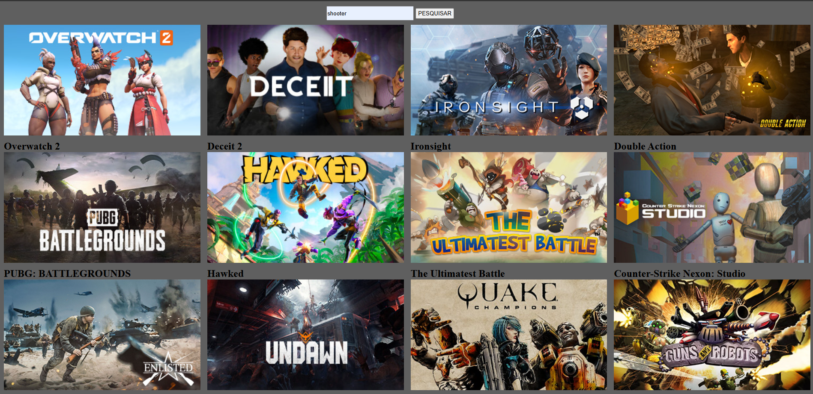

# **Projeto Doge API - Galeria de Imagens de Cachorros**

  

---

## **Sobre o Projeto**

Este projeto tem como objetivo criar uma aplicação simples para exibir **CATEGORIA DE GAMES** usando a **Free to Game**. O usuário pode pesquisar por uma categoria específica de game, e a aplicação irá mostrar uma galeria com imagens dessa categoria. A aplicação foi construída com **HTML**, **CSS** e **JavaScript**, e permite que os usuários interajam e visualizem as imagens dinamicamente.

Este projeto faz parte das atividades de desenvolvimento front-end utilizei como exemplo para expandir minhas habilidades relacionado a consumir dados de APIs e manipulação de JavaScript.

---

## **Funcionalidades**

- **Pesquisa de categoria de games**: O usuário pode inserir uma categoria de jogos e visualizar várias imagens dessa categoria.
- **Galeria de imagens**: As imagens são exibidas em uma galeria responsiva e organizada.
- **Interação simples**: Basta clicar no botão "PESQUISAR" para ver as imagens categoria de jogos escolhida.

---

## **Tecnologias Utilizadas**

- HTML
- CSS
- JavaScript
- Free to Games (https://www.freetogame.com/)
- Git

---

## **Autor**

- [Kaike Bueno](https://www.linkedin.com/in/kaike-bueno-3b10a82b1/)  